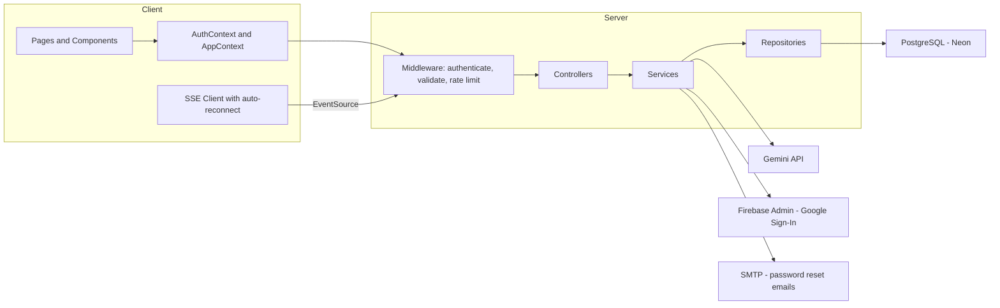
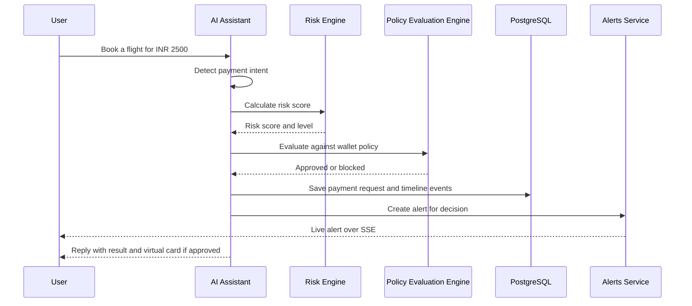
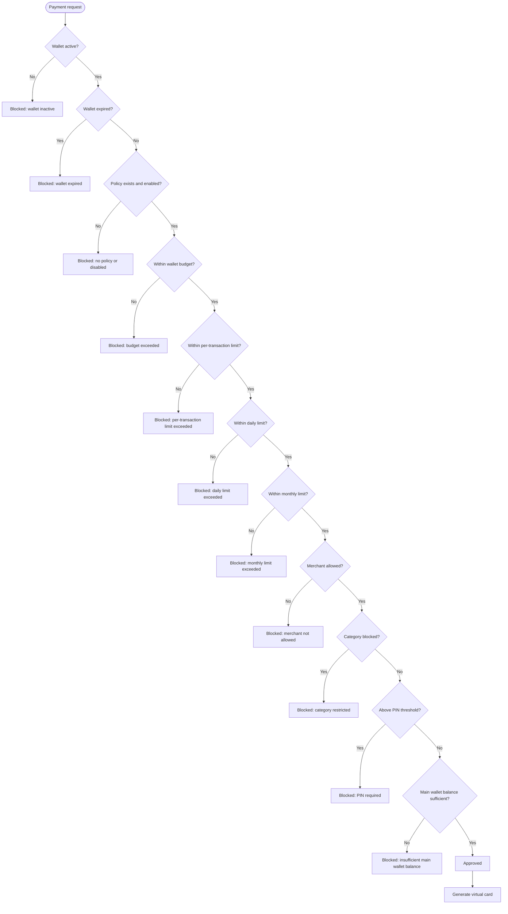

# AgentWallet

AgentWallet is an AI payment authorization platform. Users fund a Main Wallet, allocate budget into scoped AI Wallets, and let an AI Assistant book, buy, or pay for things on their behalf — every request is scored for risk, evaluated against a configurable policy engine, and either approved (with a simulated virtual card) or blocked, with a full audit trail and real-time alerts throughout.

## Feature List

- **Authentication** — email/password + Google Sign-In, JWT sessions, password reset via email
- **Main Wallet** — the funding source; top up from here
- **AI Wallets** — scoped budgets with an expiry, each with its own spending policy
- **Policy Engine** — per-wallet rules: max per-transaction, daily/monthly limits, blocked categories, allowed merchants, PIN threshold
- **AI Assistant (Gemini)** — conversational booking/purchases, with voice input, conversation history, and message edit/delete
- **AI Payment Requests & Firewall** — every request the AI generates is evaluated automatically and approved or blocked
- **Risk Engine** — a configurable-rules scorer (0–100) run on every payment request, feeding a risk level (low/medium/high/critical)
- **Virtual Card Simulation** — a 15-minute-lived simulated card is issued on approval; card number and CVV are masked everywhere except an explicit "reveal" action
- **Realtime Alerts (SSE)** — live security alerts over Server-Sent Events, with automatic reconnect and a "Reconnecting…" indicator
- **Audit Logs** — an immutable trail of every approval, rejection, execution, and card use
- **Analytics Dashboard (Observability)** — payment volume, approval/block rates, risk distribution, top merchants/categories, wallet usage, alerts/audit activity — filterable and exportable (CSV/XLSX/PDF)
- **Global Search (Ctrl+K)** — search wallets, payments, alerts, virtual cards, audit logs, and conversations from anywhere
- **Conversation History** — searchable, paginated, exportable, with rename/duplicate/archive/bulk-delete

## Architecture

### 1. Overall System Architecture



### 2. AI Payment Flow



Both the Risk Engine and Policy Evaluation Engine are pure, DB-free functions — they take the data they need as arguments and return a decision, which keeps them independently testable and reusable across the manual and AI-driven payment-creation paths.

### 3. Policy Evaluation Flow

The Policy Evaluation Engine checks eleven rules in a fixed order against a single payment request. The first rule that fails blocks the request with a specific reason; passing all eleven approves it and issues a virtual card.



## Folder Structure

```
AgentWallet/
├── client/                      React 19 + Vite + Tailwind frontend
│   ├── src/
│   │   ├── pages/               One file per route (Dashboard, Observability, ...)
│   │   ├── components/
│   │   │   ├── common/          Shared primitives (Button, Card, EmptyState, ErrorState, Spinner, ErrorBoundary, ...)
│   │   │   ├── layout/          AppLayout, Sidebar, TopBar, MobileBottomNav, ConnectionStatus, ...
│   │   │   ├── search/          Global search (Ctrl+K) palette
│   │   │   ├── wallet/ ai/ payments/ dashboard/ observability/ transactions/ approvals/ notifications/
│   │   ├── context/              AuthContext, AppContext (alerts + SSE status)
│   │   ├── hooks/                useAuth, useApp, useEscapeKey, useFocusTrap, useConversationHistory, useSpeechRecognition
│   │   ├── services/              One file per API resource (thin fetch wrappers + normalization)
│   │   ├── routes/               AppRoutes.jsx (React.lazy per page) + ProtectedRoute
│   │   └── utils/                 formatCurrency, formatDateTime, capitalize, toLookup, errorMessage, downloadFile, ...
│   └── .env.example
├── server/                      Node + Express 5 + PostgreSQL backend
│   ├── src/
│   │   ├── routes/               One file per resource, mounted in app.js
│   │   ├── controllers/          Thin — parse request, call service, shape response
│   │   ├── services/              Business logic; fail(status, message) for operational errors
│   │   ├── repositories/          Parameterized SQL only
│   │   ├── validators/            Per-resource input validation used by middleware/validate.js
│   │   ├── middleware/            authenticate, validate, rateLimit, errorHandler
│   │   ├── integrations/          gemini/, firebase/, email/
│   │   ├── db/migrations/         Sequential, numbered SQL migrations
│   │   └── utils/                 fail(), sanitizeUser()
│   └── .env.example
├── docs/
│   ├── API.md                    Full endpoint reference
│   └── DEPLOYMENT.md              Docker / docker-compose / CI details
├── Dockerfile → client/Dockerfile, server/Dockerfile
├── docker-compose.yml
└── .github/workflows/ci.yml
```

## Environment Variables

See `server/.env.example` and `client/.env.example` for the full, authoritative list with comments. Summary:

**Server**

| Variable | Required | Purpose |
|---|---|---|
| `PORT` | no (default 5000) | HTTP port |
| `NODE_ENV` | no | `development` / `production` |
| `DATABASE_URL` | yes | PostgreSQL connection string (Neon or any Postgres) |
| `JWT_SECRET` | yes | Signs session tokens |
| `JWT_EXPIRES_IN` | no (default `1h`) | Session lifetime |
| `CLIENT_APP_URL` | yes | Used to build password-reset links |
| `SMTP_HOST` / `SMTP_PORT` / `SMTP_USER` / `SMTP_PASS` / `SMTP_FROM` | yes | Password-reset emails |
| `FIREBASE_PROJECT_ID` / `FIREBASE_CLIENT_EMAIL` / `FIREBASE_PRIVATE_KEY` | only for Google Sign-In | Firebase Admin SDK |
| `GEMINI_API_KEY` | only for the AI Assistant | Gemini API key from [aistudio.google.com/apikey](https://aistudio.google.com/apikey) |

**Client**

| Variable | Required | Purpose |
|---|---|---|
| `VITE_API_BASE_URL` | yes | Backend base URL |
| `VITE_FIREBASE_API_KEY` / `VITE_FIREBASE_AUTH_DOMAIN` / `VITE_FIREBASE_PROJECT_ID` / `VITE_FIREBASE_APP_ID` | only for Google Sign-In | Firebase Web SDK config |

Everything else (Analytics dashboard, Policy Engine, Virtual Cards, Alerts, Audit Logs) works with only `DATABASE_URL` and `JWT_SECRET` set — Firebase and Gemini are optional integrations.

## Installation Guide

Prerequisites: Node.js 20+, a PostgreSQL database (a free [Neon](https://neon.tech) instance works well), npm.

```bash
git clone <repo-url> agentwallet && cd agentwallet

# Backend
cd server
cp .env.example .env        # fill in DATABASE_URL, JWT_SECRET, SMTP_*, at minimum
npm install
# apply every migration in src/db/migrations/, in order, against DATABASE_URL
npm run dev                 # http://localhost:5000

# Frontend (separate terminal)
cd ../client
cp .env.example .env        # VITE_API_BASE_URL=http://localhost:5000
npm install
npm run dev                 # http://localhost:5173
```

Migrations are plain, sequentially-numbered `.sql` files with no built-in runner — apply them with `psql "$DATABASE_URL" -f server/src/db/migrations/000N_name.sql` in order, or pipe the whole directory through `psql` in filename order.

## Deployment Guide

See [`docs/DEPLOYMENT.md`](docs/DEPLOYMENT.md) for the full walkthrough (Docker images, `docker-compose.yml`, CI, and the health endpoint). Summary:

- `server/Dockerfile` and `client/Dockerfile` build production images for each half of the app.
- `docker-compose.yml` at the repo root runs both together against an external managed Postgres (Neon) — there's no local Postgres container, since the app is built against Neon's connection string format.
- `GET /health` reports `{ status, database, timestamp }` (503 if the database is unreachable) — wire it up as your orchestrator's liveness/readiness probe.
- `.github/workflows/ci.yml` builds both the client and server on every push/PR.

## API Documentation

See [`docs/API.md`](docs/API.md) for the full endpoint reference, grouped by resource. Every route under `/api/*` except `/api/auth/*` requires `Authorization: Bearer <token>`; `/health` is public.

## Future Roadmap

- Real card-network integration behind the existing virtual-card abstraction (today's cards are simulated, 15-minute-lived, for demo purposes)
- Policy templates / presets (e.g. "conservative", "travel-friendly") instead of hand-configuring every field
- Multi-currency support (currently INR-only end to end)
- Team/shared wallets with per-member sub-limits
- A dedicated automated test suite (unit tests for the Risk Engine and Policy Evaluation Engine would be the highest-value starting point, since both are already pure functions)
- Webhook/export integrations for audit logs (SIEM-friendly streaming, not just on-demand CSV/XLSX/PDF)
